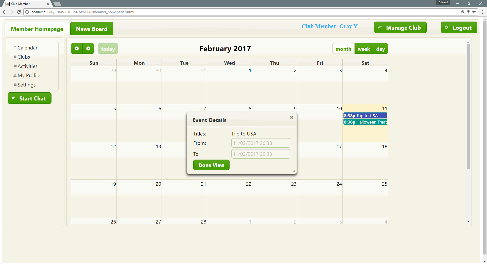

# SUMS
SUMS is a java web-based system aimed to provide a platform for users to create and manage
clubs and activities. 

## Tools used
* [PrimeFaces](http://www.primefaces.org/)
* [Hibernate ORM](http://hibernate.org/)
* [Websocket](https://github.com/Atmosphere/atmosphere)
* [Commentbox](https://www.htmlcommentbox.com/)
* [Google recaptcha](https://www.google.com/recaptcha/intro/)

## Demo
> User currently login both member role and manager role.

1. ___Login page___
    

2. ___Club member homepage (calendar view by default)___
    

3. ___Page for club member to view activities in calendar view___
    

4. ___Calendar view in weekly mode___
    

5. ___Club editor/viewer page for members___
    

6. ___Activity editor/viewer page for members___
    

7. ___Newsboard for members (memebrs are able to view news posted by club managers)___
    

8. ___News detail page with comment box___
    

9. ___Page for club managers to edit memebrs' role privilege___
    

10. ___Page for club managers to manage club profiles___
    

11. ___Newsboard for managers___
    

12. ___News editor for club managers___
    

13. ___Example of news posted by club manager___
    

14. ___Example of comments posted by users___
    

__Contributors__:  `@ZhaoC @ChanY`